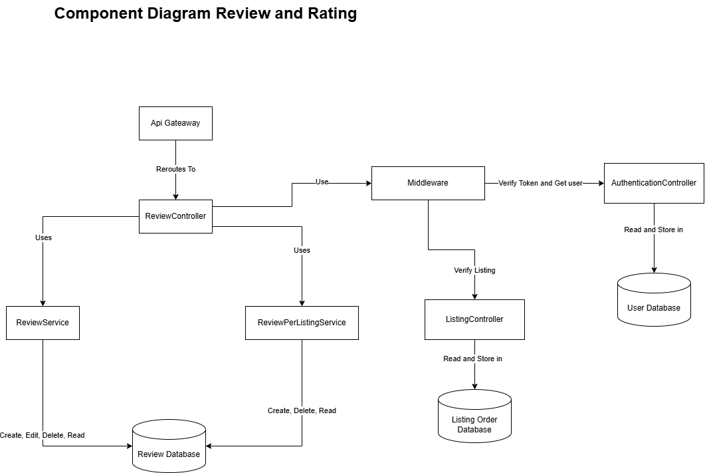
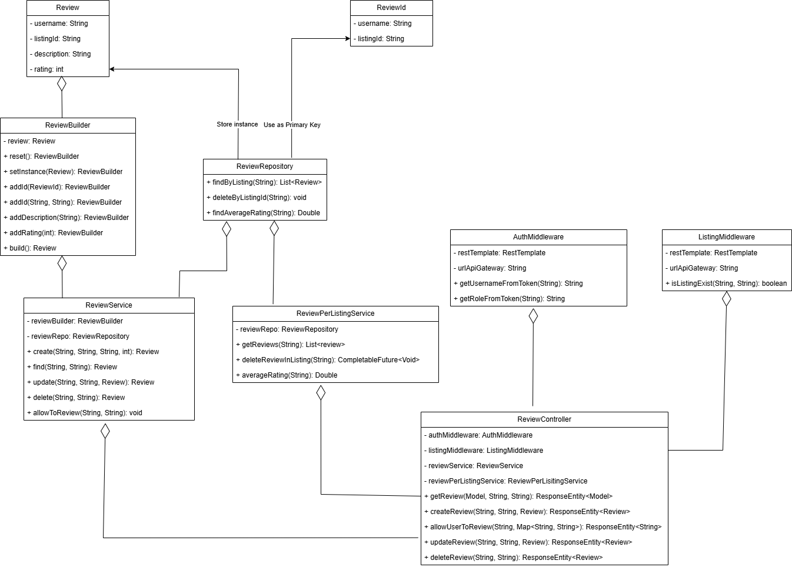

# Diagram

## Context Diagram

## Container Diagram

## Deployment Diagram

## Future Architecture 

## Risk Storming

Dipilih menggunakan pendekatan konsensus dan pada akhirnya disetujui kalau api gateway memiliki kerentanan karena memberikan semua cors untuk lewat dan juga terdapat beberapa servis yang menghardcode link ke api nya pada controller sehingga rawan.
Selain itu, Database yang dimiliki oleh fitur Sell dinilai mengandung terlalu banyak informasi dan sebaiknya dipecah untuk meningkatkan sekuritas karena pada database tersebut mengandung elemen listing, order dan juga user.

## Sell

### Sell Component Diagram
Berikut adalah diagram untuk keseluruhan hubungan komponen sell dan authenticate 

Berikut adalah diagram untuk komponen pada fitur sell saja

Berikut adalah diagram untuk komponen pada fitur auth saja

### Sell Code diagram
Untuk code diagram auth adalah sebagai berikut 

Untuk code diagram sell adalah sebagai berikut 

## Payment

### Payment Code Diagram

### Payment Component Diagram

## Buy

### Buy Component Diagram

### Buy Code Diagram

## ReviewAndRating

### ReviewAndRating Component Diagram

### ReviewAndRating Code Diagram

## Featured Listing

### Featured Listing Component Diagram

### Featured Listing Code Diagram

## StaffDashboard

### StaffDashboard Component Diagram

### StaffDashboard Code Diagram

